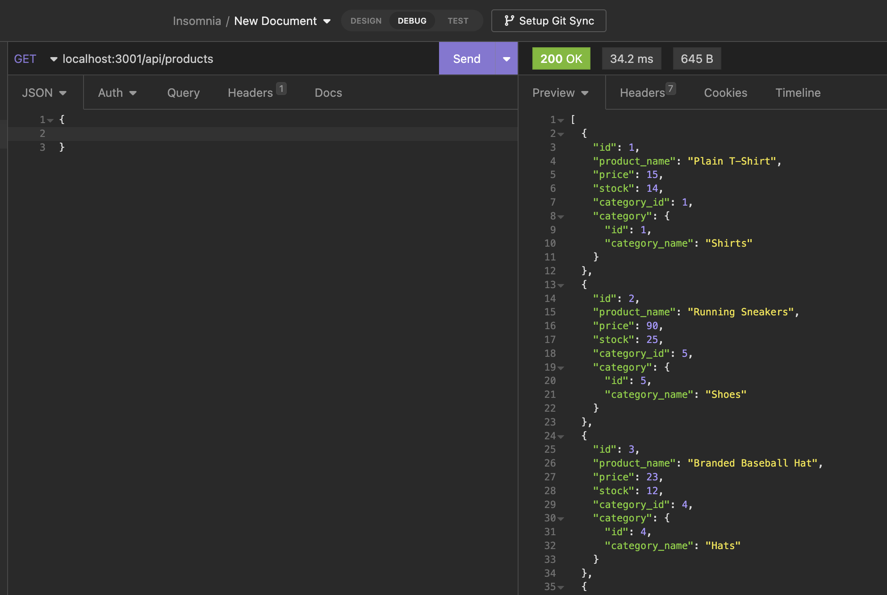

# e-commerce-back-end

AS A manager at an internet retail company
I WANT a back end for my e-commerce website that uses the latest technologies
SO THAT my company can compete with other e-commerce companies

## Acceptance Criteria 
```
GIVEN a functional Express.js API
WHEN I add my database name, MySQL username, and MySQL password to an environment variable file
THEN I am able to connect to a database using Sequelize
WHEN I enter schema and seed commands
THEN a development database is created and is seeded with test data
WHEN I enter the command to invoke the application
THEN my server is started and the Sequelize models are synced to the MySQL database
WHEN I open API GET routes in Insomnia Core for categories, products, or tags
THEN the data for each of these routes is displayed in a formatted JSON
WHEN I test API POST, PUT, and DELETE routes in Insomnia Core
THEN I am able to successfully create, update, and delete data in my database

```

## Walkthrough Video
https://drive.google.com/file/d/1M3KAhbfkcvK679teov5gl85eMXNUTKKH/view

## Link to Code
https://github.com/sarahlang9800/e-commerce-back-end

## Example Photo 


## Discription 
* e-commerce, is the largest sector of the electronics industry.
* I was able to take a working Express.js API and configured it to use Sequelize to interact with a MySQL database.
*  built the back end for an e-commerce site. 
*  all routes for all categories, all products, and all tags can be tested, updated, and deleted in Insomnia Core.`
* users can create and seed the database in the terminal. 